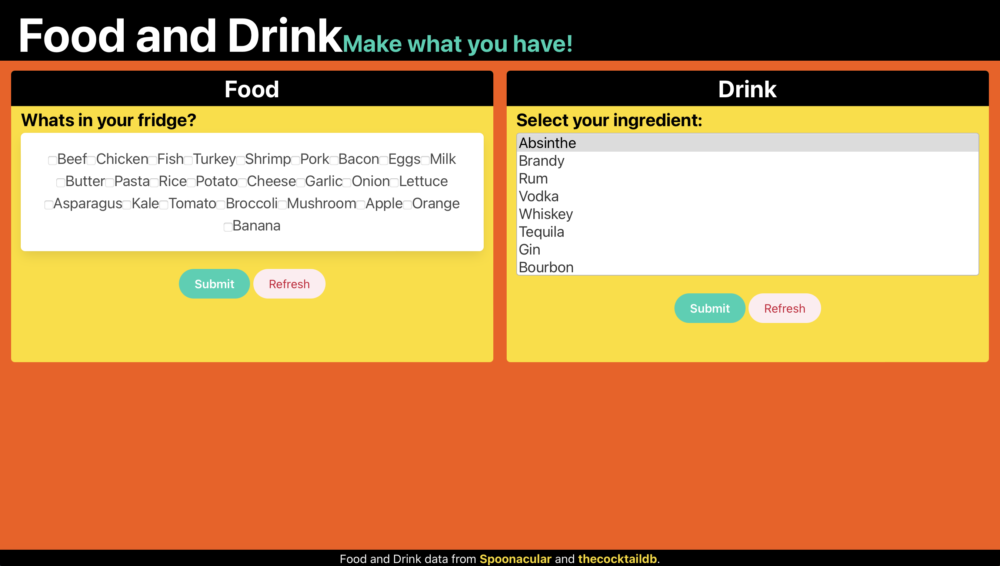
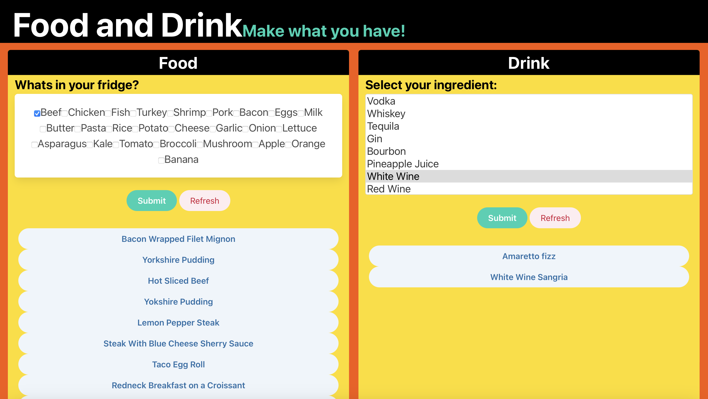

# Food And Drink Recipe Finder

## Description 

As a group project we were given the assignment of creating an interactive front-end project that will serve as a high-quality example of our work to put in our portfolios. This project is meant to showcase our collaborative skills and coding ability. 

We chose to create an app that would search for and return recipes based on a user's selected ingredients. The app has a side for food and a side for drinks. On the food side, the user can use a checkbox to mark which ingredients they have on-hand. The app will return recipe names that use those ingredients on buttons. The buttons will then link to full page recipes with images of the food and cooking directions. The drink side of the app functions similarly. The user selects a single liquor to serve as a base for their drink. The app returns buttons with drink names on them and those buttons link to full page recipes with photos and directions. 

For this project we used HTML, CSS with Bulma framework, JavaScript, and two APIs. One API used a full key while the other used a simple test key. There are no alerts, confirms, or prompts. 

The user story for this project is:

As a ... home cook 
I want ... to find recipes for meals and drinks using ingredients I already have 
So that ... I don't have to order out or go to the store 

## Site Preview

## Usage

The app can be used to find new recipes using ingredients one has on-hand. At its current functionality it will search via ingredients but future versions could include searching by food type, excluding ingredients, or by nutritional value. The drink portion could also include the ability to search for specific cocktails.

## Links

[Link to GitHub Repositorty for Food and Drink Project](https://github.com/jrwesch/FoodAndDrink)   
[Link to GitHub Pages view of website](https://jrwesch.github.io/FoodAndDrink)
